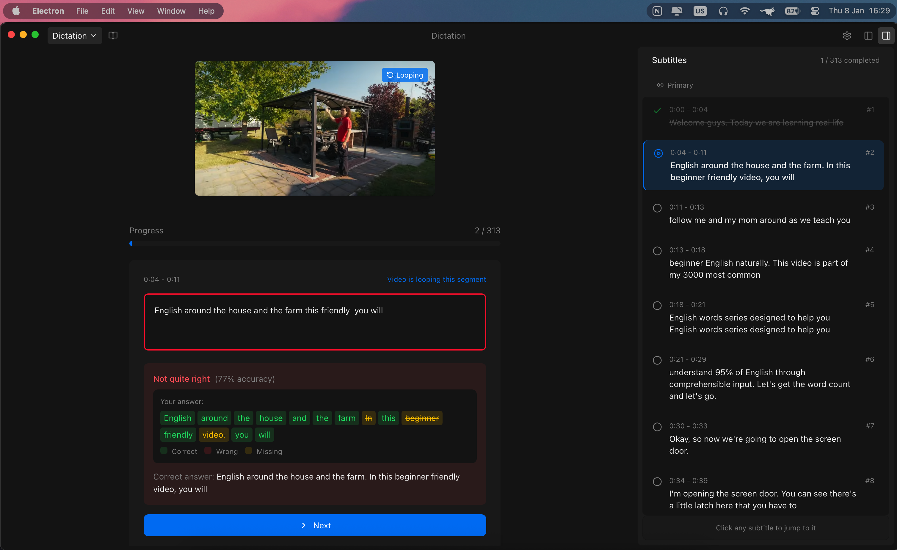

# Dictation

Ứng dụng luyện nghe tiếng Anh với video YouTube, tích hợp AI hỗ trợ học tập.

## Screenshot



## Tính năng

- Luyện nghe chép chính tả với video YouTube
- Chỉnh sửa và quản lý phụ đề
- Lưu trữ bài luyện tập
- Chatbot AI hỗ trợ (Gemini, Groq)

## Công nghệ

- **Frontend:** React 19, TypeScript, Tailwind CSS
- **Desktop:** Electron
- **State:** Redux Toolkit, Redux Persist
- **AI:** Google Gemini, Groq

## Cài đặt

```bash
# Clone repo
git clone <repo-url>
cd dictation

# Cài đặt dependencies
npm install

# Chạy development
npm run dev
```

## Scripts

| Lệnh | Mô tả |
|------|-------|
| `npm run dev` | Chạy development server |
| `npm run build` | Build web app (cho Vercel) |
| `npm run build:electron` | Build ứng dụng desktop |
| `npm run lint` | Kiểm tra lỗi ESLint |
| `npm run preview` | Preview bản build |

## Build

### Web (Vercel, Netlify, ...)

```bash
npm run build
```

Output: `dist/`

### Desktop (Electron)

```bash
npm run build:electron
```

Output: `release/` - Windows (.exe), macOS (.dmg), Linux (.AppImage)


## License

MIT
